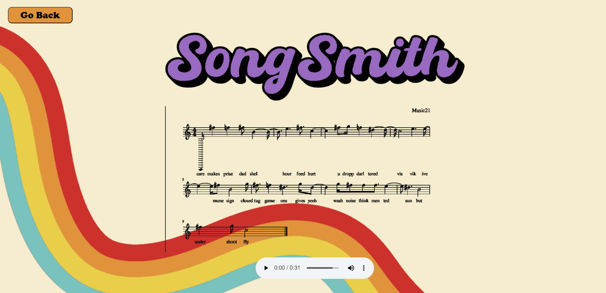

# SongSmith
SongSmith is a senior project created by three UF students. 

It is a Django web app that takes in lyrics and generates a corresponding MIDI melody based on the lyrics. It uses a TransGAN neural network written in PyTorch that was trained on the [Lakh MIDI Dataset](https://colinraffel.com/projects/lmd/).

We also wrote up a related blog post/article going over how our model works and the machine learning concepts underlying it. The article is meant to be accessible to any intelligent lay reader (no ML or programming experience required). [Link here](https://docs.google.com/document/d/e/2PACX-1vQbTkpfa3knbxaFnrgBDn7Zeg-wsnIkrWyoAxO6XqIjzeTH5ncaVSt8dozZA8A6IdTVVJDU95Scfv9j/pub).

# Running the Project
There are several steps to run the project.

In order to create MIDI files, you must install some peices of software:
1. Musescore3 (Musescore4 breaks this) - https://musescore.org/en/3.6.2
2. Fluidsynth - https://www.fluidsynth.org/download/
3. Any MIDI instrument (we used https://www.nerds.de/en/ipmidi.html, the trial version didn't seem to cause issues).

On top of this, you will need several python libraries:
<ul>
<li>pretty_midi</li>
<li>music21</li>
<li>soundfile</li>
<li>torch</li>
<li>torchtext</li>
<li>torchdata</li>
<li>numpy</li>
<li>pyphen</li>
<li>IPython</li>
<li>flask</li>
<li>Pyfluidsynth (make sure you don't have fluidsynth installed before doing this, having both breaks the whole thing due to an empty project on pip and python not knowing how to fix itself)</li>
</ul>

Last, you will have to go into the generate_song.py located in the ui folder on line 20, there is a line: ```music21.environment.set("musescoreDirectPNGPath", "..")```. You need to change the second argument to be the absolute directory to your musescore3 executable after this is done, you can run main.py in the ui folder which will launch the webapp, and everything should work perfect.

If you have any issues, pyfluidsynth tends to be the issue. https://github.com/nwhitehead/pyfluidsynth is where you can find the readme to verify install was correct.

# Screenshots


