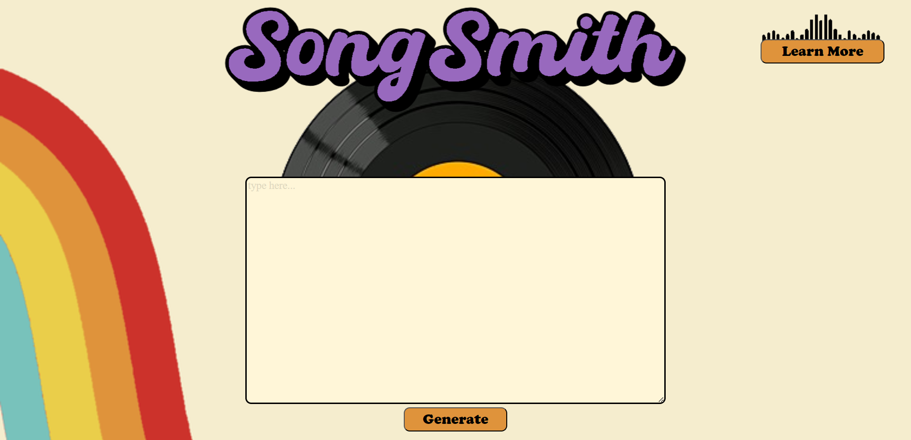

In order to run this there are several steps you need to take

first, you will need 2 pieces of software installed because your computer must be able to create midi files:
1. Musescore3 (needs to be 3, musescore4 breaks this) - https://musescore.org/en/3.6.2
2. Fluidsynth - https://www.fluidsynth.org/download/
3. any midi instruments installed to your computer, https://www.nerds.de/en/ipmidi.html was one that worked for us, the trial version didnt seem to cause issues

on top of this, you will need several python libraries:
<ul>
<li>pretty_midi</li>
<li>music21</li>
<li>soundfile</li>
<li>torch</li>
<li>torchtext</li>
<li>torchdata</li>
<li>numpy</li>
<li>pyphen</li>
<li>IPython</li>
<li>flask</li>
<ul>
pyfluidsynth (make sure you don't have fluidsynth installed before doing this, having both breaks the whole thing due to an empty project on pip and python 		  not knowing how to fix itself)

last, you will have to go into the generate_song.py located in the ui folder
on line 20, there is a line:  
 music21.environment.set("musescoreDirectPNGPath", "..")  
you need to change the second argument to be the absolute directory to your musescore3 executable
 after this is done, you can run main.py in the ui folder which will launch the webapp, and everything should work perfect

if you have any issues, pyfluidsynth tends to be the issue, https://github.com/nwhitehead/pyfluidsynth here is where you can find the readme to verify install was correct

learn more word doc: https://docs.google.com/document/d/e/2PACX-1vQbTkpfa3knbxaFnrgBDn7Zeg-wsnIkrWyoAxO6XqIjzeTH5ncaVSt8dozZA8A6IdTVVJDU95Scfv9j/pub

  

